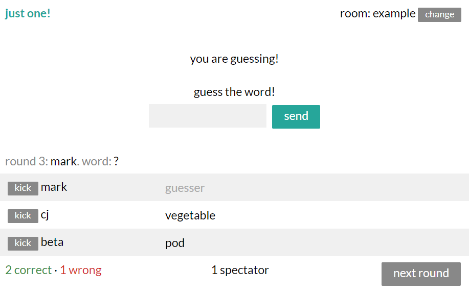

# just one!

a web app for playing [just one](https://boardgamegeek.com/boardgame/254640/just-one), a cooperative party word game. hosted on https://just1.herokuapp.com/.

in each round, the guesser is trying to guess a word. everyone not guessing writes a single-word clue. then everyone compares clues, and hides clues that are the same. they show the clues to the guesser, who then tries to guess the word.

you can join room example by going directly to https://just1.herokuapp.com/room/example. if you don’t type a name when prompted, you spectate the room.

## implementation details

inspired by [betaveros/castlefall](https://github.com/betaveros/castlefall), the app relies on the players to trust each other. so anyone can kick anyone else, including themselves. joining a room with the same name as an existing player kicks and replaces them, so you can reconnect as yourself if you disconnect.

server uses express and socket.io; frontend uses react.

### build

run `npm install`. development runs on two servers, one for the socket, and one for the client. running `npm start` starts the socket server, and running `npm run hotloader` starts the client server.

you will need a wordlist. the server [Room.js](server/Room.js) assumes you have a wordlist in the same folder named `beta.json`. this wordlist should contain one object with the key `words`, and value an array of a list of strings.

when you deploy, remember to change the client [Room.js](client/Room.js) to have `window.location.port` rather than the hardcoded development port `4001`. run `npm run build` in the client folder. deployment only runs on one server, which runs when you do `npm start`.

### todo

- sanitize names, clues, and guesses?
- "add clues" feature after a round ends?
- add a timer? or like, a timer that counts up, resetting every phase?
